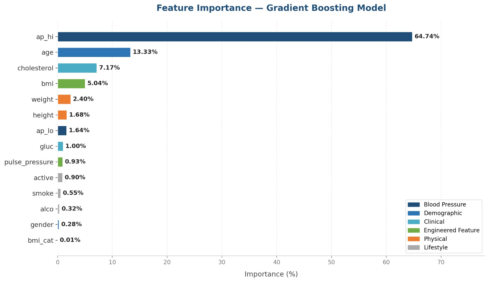
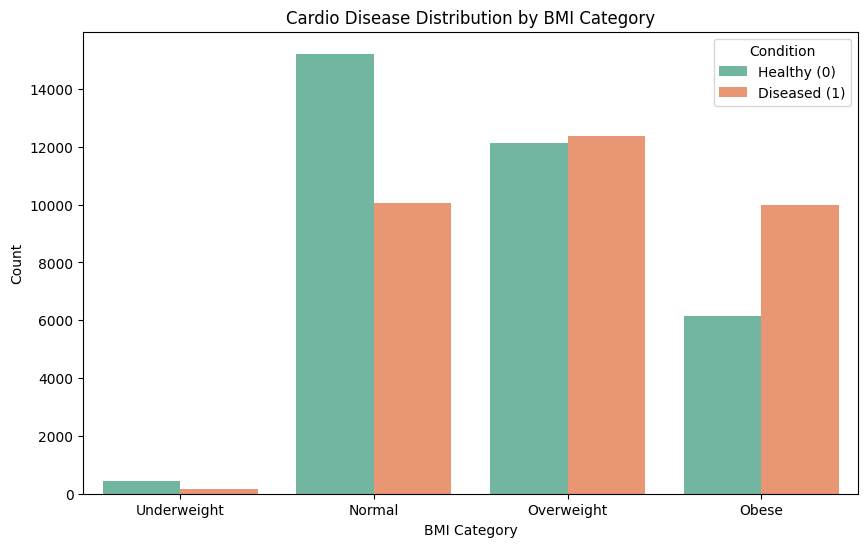
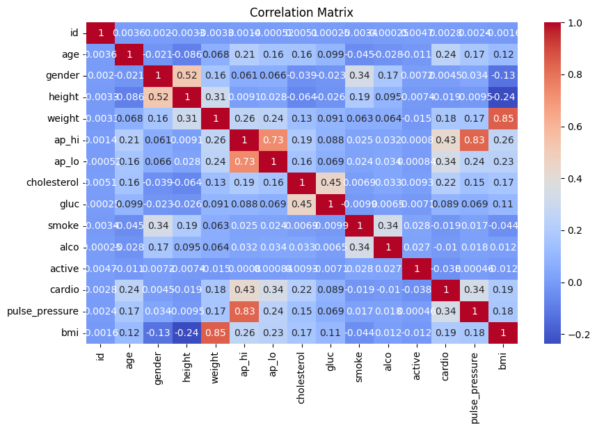
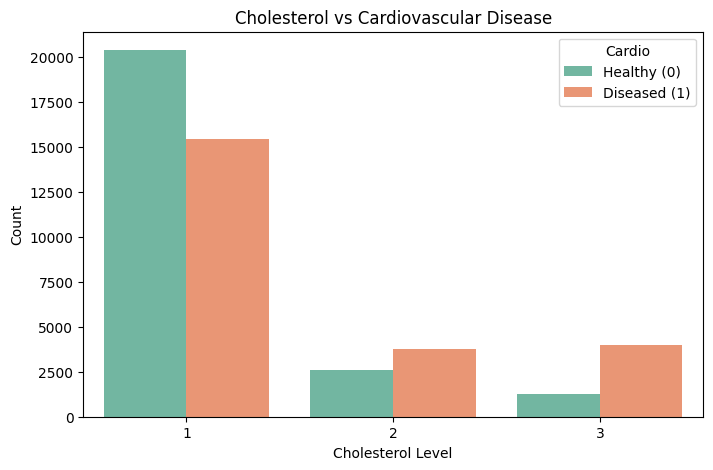

# 🫀 Cardiovascular Disease Prediction


> A machine learning project to predict the presence of cardiovascular disease using patient health data.

---

## 👥 Team Members

- Raneem Mansour
- Qutada Shobaki
- Sara Allan
- Yousef Ghawi
- Raghad Qafesha

---

## 🎯 Problem and Goal

### What are we trying to solve?
Cardiovascular disease (CVD) is the **#1 cause of death globally**, yet many cases go undetected until it's too late.  
This project builds a **binary classification model** that predicts whether a patient has cardiovascular disease based on medical and lifestyle features — enabling early detection and better clinical decisions.

### Why does it matter?
Early prediction can:
- Help doctors prioritize high-risk patients
- Reduce unnecessary tests for low-risk patients
- Support preventive care and lifestyle interventions

---

## 📦 Data

**Source:** [Kaggle — Cardiovascular Disease Dataset](https://www.kaggle.com/datasets/sulianova/cardiovascular-disease-dataset)

**Size:** 70,000 patient records | 11 features + 1 target

### What does one row represent?
Each row represents **one patient** who underwent a medical examination, with their physical measurements, lab results, and lifestyle habits.

### Features

| Feature | Type | Description |
|---|---|---|
| `age` | int (days) | Patient age in days |
| `gender` | binary | 1 = Female, 2 = Male |
| `height` | int (cm) | Height |
| `weight` | float (kg) | Weight |
| `ap_hi` | int | Systolic blood pressure |
| `ap_lo` | int | Diastolic blood pressure |
| `cholesterol` | categorical | 1 = Normal, 2 = Above normal, 3 = Well above normal |
| `gluc` | categorical | 1 = Normal, 2 = Above normal, 3 = Well above normal |
| `smoke` | binary | Smoking status |
| `alco` | binary | Alcohol intake |
| `active` | binary | Physical activity |
| **`cardio`** | **binary** | **Target: 1 = CVD present, 0 = CVD absent** |

### Limitations & Notes
- No missing values found 
- Age is stored in days, not years — converted to years in preprocessing
- **Outliers** exist in blood pressure(ap_hi , ap_lo),height and weight columns, (some negative values, and extremely high readings) - rows removed  
- The impossible blood pressure values (ap_hi < ap_lo) where removed
- Cholesterol & Glucose -Most patients have normal levels (median = 1 for both)
- Lifestyle columns (smoke, alco, active) Only **~8.8%** of patients smoke, Only **~5.4%** drink alcohol, **~80%** are physically active.
- Target Variable (cardio) -Mean of **~0.50** means the dataset is perfectly balanced 
---

## 🔍 Approach

### 1. Data Cleaning
- Convert `age` from days → years
- Remove physiologically impossible values:
  - Blood pressure: `ap_hi < 0`, `ap_lo < 0`, `ap_hi < ap_lo`
  - Remove Height and weight outliers  

### 2. Feature Engineering
- **BMI** — Body Mass Index calculated as weight / (height in metres)^2
- **Pulse Pressure** — Difference between systolic and diastolic BP (ap_hi - ap_lo)
- **Mean Arterial Pressure (MAP)** — Calculated as (ap_hi + 2 * ap_lo) / 3
- **BMI Category** — Binned into 4 clinical categories: underweight, normal, overweight, obese
- **Hypertension Flag** — Binary flag: 1 if ap_hi >= 130 or ap_lo >= 80
- **Age Group** — Binned into 5 groups: under 40, 40-50, 50-55, 55-60, over 60

### 3. Exploratory Data Analysis (EDA)
- Distribution of BMI Categories
- Cardio Disease Distribution by BMI Category
- Age Distribution
- The relationship between age and BMI
- Pressure Distribution
- Pulse Pressure Distribution
- BMI Category vs Pulse Pressure
- Correlation heatmap of all features

### 4. Modeling
  **1. Gradient Boosting (XGBoost)**
   Builds an ensemble of decision trees sequentially, where each new tree
   corrects the residual errors of the previous ones.

   #### Key Hyperparameters: `n_estimators=300` · `learning_rate=0.05` · `max_depth=5` · `subsample=0.8`

   > ⚠️ No feature scaling required.


  **2. Neural Network (Keras)**
   A Multi-Layer Perceptron (MLP) with 3 hidden layers (128 → 64 → 32 neurons),
   ReLU activation, Adam optimizer, and early stopping.

   > ⚠️ Requires StandardScaler fitted on training data only.

### 5. Evaluation Metrics
- Accuracy
- Precision, Recall, F1-Score

 
---

## 📊 Results


| Model | Accuracy | Precision | Recall |
|---|---|---|---|
| Gradient Boosting (XGBoost) | 73.92% | 74% | 74% |
| Neural Network (Keras) | 73.80% | 74% | 73% |
|Baseline (majority class) | 50.00%	| — | — |


### Key Charts

**1. Feature Importance (XGBoost)**

> ap_hi alone accounts for 62% of the model's predictive signal, followed by age and cholesterol.

**2. Cardio Disease Distribution by BMI Category**

> Obese patients showsignificantly higher CVD rates compared to normal weight patients.

**3. Correlation Heatmap**           

> ap_hi, age, and cholesterol show the strongest correlations with the target variable.

**4. Cholesterol vs Cardio**

> Patients with above-normal and well-above-normal cholesterol levels show a notably higher CVD rate.


## 💡 Conclusion

### What did we learn?

- **Systolic blood pressure (`ap_hi`) is the dominant predictor** —
  accounting for over 62% of the model's predictive signal alone
- **Age and cholesterol** are the second and third most important features
  at 13.8% and 6.97% respectively
- **Feature engineering added real value** — BMI and MAP (engineered features)
  ranked in the top 5 most important features
- **Pulse pressure analysis revealed** that obese patients maintain the 
  highest median pulse pressure, confirming BMI as a direct 
  cardiovascular risk factor beyond weight alone
- **Lifestyle features (smoking, alcohol, activity) contributed very little**
  — self-reported lifestyle data is noisy and unreliable in this dataset
- **Both models converged at ~73–74% accuracy**, which is consistent with
  published benchmarks for this dataset — confirming the ceiling is
  data-driven, not model-driven
- **XGBoost slightly outperformed Keras** (73.84% vs 73.54%) with faster
  training and no need for feature scaling
- **Data cleaning matters** — 1,369 rows were removed due to physiologically
  impossible values (e.g., negative blood pressure), improving data quality


### What would we recommend or do next?

-  **Deploy XGBoost** as the production model — higher accuracy, faster,
  interpretable, and no scaling required
-  **Add richer clinical features** such as ECG readings, blood panel results,
  imaging data, and family history — the current dataset lacks these
-  **Ensemble both models** (XGBoost + Keras) for a potential 0.5–1%
  accuracy gain with no additional data collection
-  **Validate on a geographically labeled dataset** to test generalizability
  across different populations
-  **Address noisy self-reported data** — smoking, alcohol, and activity
  features need more reliable collection methods

---

## ⚠️ Limitations & Ethics

### Model Limitations
- **Data ceiling at ~73–74%** — both models converged at the same accuracy, confirming the limit is imposed by the data itself, not the models
- **Weak feature correlations** — the strongest correlation with the target is `age` at only 0.24, followed by `cholesterol` at 0.22
- **Limited clinical scope** — the dataset lacks ECG readings, imaging results, family history, and detailed blood panel data
- **1,369 rows removed** during cleaning due to physiologically impossible values in blood pressure, height, and weight
- **Temporal limitation** — it is unclear when the data was collected, which may affect its relevance to current patient populations

### Ethical Considerations
- **Not a diagnostic tool** — this model is a decision-support aid only and must not replace clinical judgment or medical expertise
- **Noisy self-reported data** — smoking, alcohol, and physical activity features contain significant measurement error, making them unreliable predictors
- **Gender imbalance** — ~60% of records are female, which may reduce prediction accuracy for male patients
- **No geographic label** — the dataset has no identified origin, meaning results may not generalize to all populations or regions
- **Data privacy** — any real-world deployment must comply with strict patient data protection protocols (e.g., HIPAA / GDPR)
---


## 🚀 How to Run

### Google Colab

1. **Open the notebook:**
   👉 [Click here to open in Google Colab](https://colab.research.google.com/drive/1QwVpBq_hEQJl069BxsDo2fmcq_if0pZ0#scrollTo=6Bm0cY23yvHQ)

2. **Download the dataset from Kaggle:**
   [Cardiovascular Disease Dataset](https://www.kaggle.com/datasets/sulianova/cardiovascular-disease-dataset)
   * **File name:** `cardio_train.csv`

3. **Upload to Colab:**
   Left sidebar → Files icon → Upload `cardio_train.csv`

4. **Run all cells:**
   `Runtime` → `Run All` (Ctrl + F9)


### Dependencies (auto-installed in Colab)
```python
pandas
numpy
matplotlib
seaborn
scikit-learn
tensorflow 
xgboost
```

---

## 📁 Project Structure   

```
CARDIOVASCULAR-DISEASE-CAPSTONE-PROJECT
├── CapstoneProject/
│   ├── Cardiovascvlr.ipynb         
│   ├── gradient_boosting_model.pkl 
│   ├── neural_network_model.pkl   
│   └── scaler.pkl                 
├── Images/                         
│   ├── bmi_cardio.png
│   ├── Cardio-Class-Balance.png
│   ├── cholesterol_cardio.png
│   ├── correlation_heatmap.png
│   └── feature_importance.png
├── WEB/
│   ├── BackEnd/
│   │   ├── app.py                  
│   │   ├── gradient_boosting_model.pkl
│   │   └── requirements.txt        
│   └── FrontEnd/
│       ├── index.html              
│       ├── script.js               
│       └── styles.css              
└── README.md
            
```
